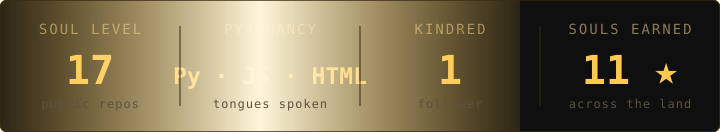

<p align="center">
  
</p>

> Rendering as a black card in light mode; **dark mode recommended**. ⚠️ The fire, embers and
> shimmer are pure SVG *SMIL* animations — GitHub blocks JS, but animated SVG plays natively.

```text
  Whisper not of "AI wrote this".
  My ghosts write, deploy and reign in the cloud.
  I just hold the (bon)fire.
```

> *"Why walk into the fog... when you can spawn your agents in the cloud?"*
>
> **Don't you dare go Hollow.**

This profile was **forged by its own ghosts** — roughly **99% of every repo here was spec'd,
coded, tested and deployed by AI agents** (opencode · openclaw) that I orchestrate, from feature
specs to CI auto-deploys. The flex isn't "writing code with AI". It's **pointing AI at the cloud
and watching it deploy itself — 24/7, with zero local machines left running.**

---

## ▶ SELECT CHARACTER

| SLOT | STATUS |
|---|---|
| ⚔️ **CLASS** | Ghost of the Machine — AI agent orchestration · cloud ops · automations |
| ⛳ **PLAYTHROUGH** | Started 14/10/2025 · NG+ unlocked |
| 🕯️ **SOUL LEVEL** | `17` (public repos) |
| 🔥 **SOULS COLLECTED** | `11` ⭐ (gathered across the land) |
| 🌙 **ESTUS FLASKS** | `1` (rare, precious follower) |

**How I forge** — I don't "vibecode". I orchestrate agents like soldiers:

| PHASE | TOOL |
|---|---|
| Specs & acceptance criteria | opencode (spec-driven, mechanically audited) |
| The agents themselves | openclaw — retired, living in the cloud |
| LLM routing (free tier) | 9router — the relay that never sleeps |
| Deploy | GH Actions → SquareCloud, auto on push |
| Writing on the wall | this README and its animated svg — also by agent |

---

## 📡 RELIC FORGE — the cloud trinity

The repos that keep AI **alive in the cloud**, 24/7, without a single local machine:

| RELIC | KIND | CHANGED FROM UPSTREAM | PAYOFF |
|---|---|---|---|
| [**9router**](https://github.com/JBRYAN333/9router) | fork | Next.js **standalone** build for SquareCloud · added `/api/classify` secure proxy · `maxContextTokens` cap | free-tier LLM routing that never sleeps |
| [**openclaw**](https://github.com/JBRYAN333/openclaw) | fork | **device-auth disabled** for headless run · `gateway.mode` fixed for cloud · env-driven config/token | the agent itself, resident in the cloud |
| [**claude-cloud**](https://github.com/JBRYAN333/claude-cloud) | own | homemade CLI→9router bridge (socat tunnel, `index.js`/`start.sh`/Dockerfile) | run your coding CLI from anywhere |

> Why it matters: **run in the cloud, not on your machine.** A fork isn't "someone else's code
> with my name on it" — it's upstream + my cloud-adoption layer. (MIT licenses preserved upstream.)

---

## 🗄 EQUIPMENT LOADOUT — chosen weapons

| WEAPON | DESC | KIND |
|---|---|---|
| 🩺 [**android-adb-doctor**](https://github.com/JBRYAN333/android-adb-doctor) | Diagnoses & operates Android via adb, no root — RF/telephony, data, storage, dex2oat | `skill` ⭐ |
| 📊 [**financas-ai**](https://github.com/JBRYAN333/financas-ai) | AI-classified expense control for micro-entrepreneurs | `repo` |
| 📎 [**gmail-attachment-sentinel**](https://github.com/JBRYAN333/gmail-attachment-sentinel) | Gmail attachment backup & audit → Drive | `repo` |
| 🛰️ [**Universal-Data-Harvester**](https://github.com/JBRYAN333/Universal-Data-Harvester) | Modular multi-source data harvesting & export | `repo` |
| 🎮 [**pl-dashboard**](https://github.com/JBRYAN333/pl-dashboard) | DW2 Pro League records/rankings dashboard | `dw2` |
| 🤖 [**hcl-bot**](https://github.com/JBRYAN333/hcl-bot) | Discord league manager / rankings for competitive communities | `dw2` |
| 👾 [**pl-bot**](https://github.com/JBRYAN333/pl-bot) | DW2 Pro League consult bot | `dw2` |
| 🧰 [**preset-editor**](https://github.com/JBRYAN333/preset-editor) | Visual preset editor for DW2 customization | `dw2` |

---

## 🏆 ACHIEVEMENTS UNLOCKED

- ☀️ **Praise the Sun** — first open-source seed planted (2025)
- ⚔️ **First Flame** — `android-adb-doctor`, a niche born empty, claimed first
- 🏰 **Lord of Cinders** — DW2 ecosystem: 3 bots + dashboard + editor
- 📡 **Linked the Cloud** — AI agents retired from local boxes, running 24/7 on the cloud
- 🔥 **Seeker of Souls** — AI finance & lead-gen automations (FAI · ProspectOS)

---

## 🛡 COVENANTS

- 🐦 **DW2 Realm** — the Pro League, its bots and rankings
- 📜 **FAI Guild** — finance intelligence (officially deployed)
- 🧿 **The Deep** — long-running AI agent experiments (skills · MCP · harness)
- 💨 **Cloudborn** — forks re-born as 24/7 cloud services

---

## 📊 SOUL COUNTER

> Self-hosted stats card, **reforged nightly by its own ghosts** — a GH Actions workflow
> recomputes and re-renders the numbers from the API at dawn. No external services, no stale stats.

<p align="center">
  
</p>

## 🐍 LINK THE FLAME

> The First Flame must be fed. A serpente de madeira (contribution snake) is reproduced at every
> dawn by Actions — watch it devour the graph of contributions.

<p align="center">
  <picture>
    <source media="(prefers-color-scheme: dark)" srcset="output/snake-dark.svg">
    <source media="(prefers-color-scheme: light)" srcset="output/snake-light.svg">
    
  </picture>
</p>

| | |
|---|---|
|  | — |

---

## 💀 SENDS ITS REGARDS

> *"Ashen one... if you are reading this, a ghost wrote it."*

Open a dungeon (issue) on any weapon above — or whisper from beyond via
[@JBRYAN333](https://github.com/JBRYAN333).

```text
                                                            𝕋𝕙𝕖 𝔻𝕒𝕣𝕜 𝕊𝕠𝕦𝕝𝕤 𝕠𝕗 𝕔𝕠𝕕𝕖
        agent-orchestrated  ·  cloud-hollowed  ·  still praising the sun
```

<sub>*Totally unrelated to FromSoftware. Dark Souls style, 100% original fluff. Repos are
real; the achievements are earned.</sub>